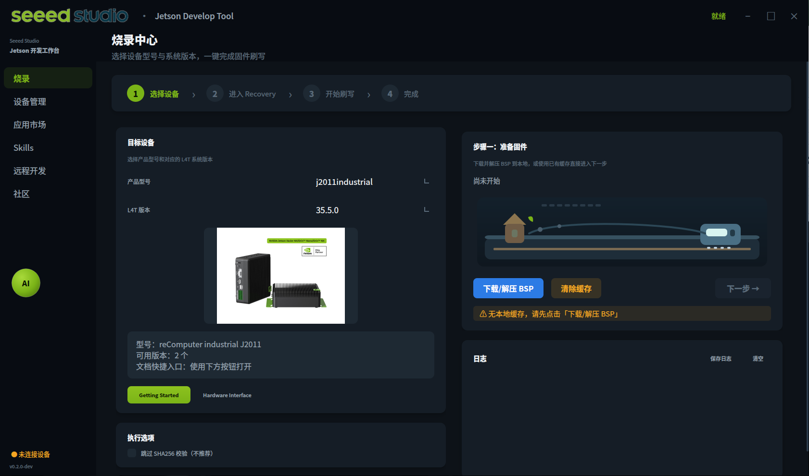

# Seeed Jetson 开发工具

面向 Seeed Studio Jetson 全系列产品的 AI 开发工作台，覆盖从刷机到应用部署的完整流程。

[](https://opensource.org/licenses/MIT)
[](https://www.python.org/)
[]()

[English](README.md)



---

## 功能概览

| 模块 | 状态 | 说明 |
|------|------|------|
| 烧录中心 | ✅ | 全系列 Jetson 固件下载、SHA256 校验、一键刷写，支持断点续传 |
| 设备管理 | ✅ | 快速诊断、外设检测、实时设备信息采集 |
| 应用市场 | ✅ | 浏览并安装 AI 应用 — YOLOv8、Ollama、DeepSeek、Node-RED 等 |
| Skills | ✅ | 50+ 内置技能，覆盖驱动修复、AI 部署、系统优化 |
| 远程开发 | ✅ | SSH 连接、VS Code Server、Jupyter Lab、VNC 远程桌面、AI Agent 安装 |
| PC 网络共享 | ✅ | 将 PC 网络共享给 Jetson，自动检测并转发 PC 代理 |
| Jetson 初始化 | ✅ | 首次开机串口向导，完成用户名、网络和系统配置 |
| 社区 | ✅ | Wiki、论坛、Discord、视频教程快捷入口 |

---

## 系统要求

- **主机系统**：Ubuntu 20.04 / 22.04 / 24.04（烧录功能推荐 Linux）
- **Python**：3.10+
- **依赖**：PyQt5、paramiko、requests

---

## 安装

```bash
git clone https://github.com/Seeed-Projects/Seeed-Jetson-DevelopTool.git
cd Seeed-Jetson-DevelopTool
pip install -r requirements.txt
```

启动 GUI：

```bash
python3 run_v2.py
```

---

## 支持设备

### reComputer Super（Orin NX / Nano）
| 型号 | L4T |
|------|-----|
| J4012s (16GB) / J4011s (8GB) | 36.4.3 |
| J3011s (8GB) / J3010s (4GB) | 36.4.3 |

### reComputer Mini（Orin NX / Nano）
| 型号 | L4T |
|------|-----|
| J4012mini / J4011mini | 36.3.0, 35.5.0 |
| J3011mini / J3010mini | 36.4.3, 36.3.0, 35.5.0 |

### reComputer Robotics（GMSL，Orin NX / Nano）
| 型号 | L4T |
|------|-----|
| J4012robotics / J4011robotics | 36.4.3 |
| J3011robotics / J3010robotics | 36.4.3 |

### reComputer Classic（Orin NX / Nano）
| 型号 | L4T |
|------|-----|
| J4012classic / J4011classic | 36.4.3, 36.4.0, 36.3.0, 35.5.0 |
| J3011classic / J3010classic | 36.4.3, 36.4.0, 36.3.0, 35.5.0 |

### reComputer Industrial（Orin NX / Nano）
| 型号 | L4T |
|------|-----|
| J4012industrial / J4011industrial | 36.4.3, 36.4.4, 36.4.0, 36.3.0, 35.5.0, 35.3.1 |
| J3011industrial / J3010industrial | 36.4.3, 36.4.0, 36.3.0, 35.5.0, 35.3.1 |
| J2012industrial / J2011industrial（Xavier NX） | 35.5.0, 35.3.1 |

### reServer Industrial（Orin NX / Nano）
| 型号 | L4T |
|------|-----|
| J4012reserver / J4011reserver | 36.4.3, 36.4.0, 36.3.0 |
| J3011reserver / J3010reserver | 36.4.3, 36.4.0, 36.3.0 |

### J501 载板（AGX Orin）
| 型号 | L4T |
|------|-----|
| 64GB / 32GB（标准版 + GMSL 版） | 36.4.3, 36.3.0, 35.5.0 |

---

## 烧录流程

1. 选择设备型号和 L4T 版本
2. 点击**下载/解压 BSP** — 自动下载固件并进行 SHA256 校验，支持断点续传
3. 将设备进入 Recovery 模式（按住 Recovery 键后上电）
4. 点击**检测设备**确认 USB 连接
5. 点击**开始刷写** — 约需 2–10 分钟

> 烧录需要 Linux 主机。Windows 用户可使用配置了 USB 透传的 WSL2。

---

## 远程开发

通过 SSH 连接 Jetson 后可使用：

- **VS Code Server** — 在浏览器中直接编辑 Jetson 上的代码
- **Jupyter Lab** — 交互式 Python 开发环境
- **VNC 远程桌面** — 通过浏览器（noVNC）或 VNC 客户端访问 Jetson 图形桌面
- **AI Agent 安装** — 在 Jetson 上安装 Claude Code、Codex 或 OpenClaw CLI
- **PC 网络共享** — 将 PC 网络共享给 Jetson，自动检测 PC 代理端口并转发

---

## Skills

50+ 内置技能，覆盖以下方向：

- **驱动 & 系统修复**：USB-WiFi（88x2bu）、5G 模块、蓝牙冲突、NVMe 启动、Docker 清理
- **AI & 大模型**：PyTorch、Ollama、DeepSeek、Qwen2、LeRobot、vLLM
- **视觉 / YOLO**：YOLOv8、DeepStream、NVBLOX、深度估计
- **网络 & 远程**：VS Code Server、VNC、SSH 密钥、代理配置
- **系统优化**：最大性能模式、Swap 配置、风扇控制、缓存清理

支持 [OpenClaw](https://github.com/Seeed-Studio/openclaw) 格式的社区技能，放入 `skills/openclaw/` 目录后自动加载。

---

## CLI

```bash
# 列出支持的产品
python3 -m seeed_jetson_develop.cli list-products

# 查看 Recovery 教程
python3 -m seeed_jetson_develop.cli recovery -p j4012mini

# 刷写固件
python3 -m seeed_jetson_develop.cli flash -p j4012mini -l 36.3.0
```

---

## 文档

- [docs/QUICKSTART.md](docs/QUICKSTART.md) — 快速上手
- [docs/USAGE.md](docs/USAGE.md) — CLI 详细用法
- [docs/GUI_GUIDE.md](docs/GUI_GUIDE.md) — GUI 使用指南

---

## 技术支持

- Wiki：https://wiki.seeedstudio.com/
- 论坛：https://forum.seeedstudio.com/
- Discord：https://discord.gg/eWkprNDMU7

---

## License

MIT
